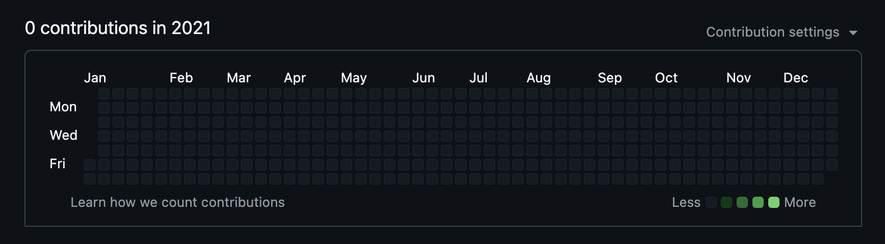

# 1 Month, 4 Interviews, 3 Offers, 0 Applications

> #### TLDR;
>
> Within a month of bein laid off from my job, I managed to source interviews with 4 companies, landing 3 job offers because of work I had done and connections I had made in previous years. These actions include building, writing, and networking.

Since my sophomore year at San Jose State, I dreamed of working at a MAANG company, but to be completely honest with you, I don't think I ever believed I would make it to one. Today, I get to say I proved everyone wrong (including myself). The kicker: I was unemployed just over a month ago.

### What happened?

Long story short, I got let go from an early-stage start-up midway through this past march (2025).

I'll be releasing another article this month detailing what went wrong and the emotions I felt along the way, but that's not why I'm writing today. The point of this article is to give you the secrets that I believe allowed me to be successful in my job hunt.

(And unfortunately you're probably not going to like them)

### Before I get into it, Let's build some rapport

I know you're probably skeptical. I've read so many articles before and thought "Well obviously it's so easy for **them** to get a job, but that would never work for me", so let me give you a little bit of background.

I was a software engineering major in college, and I did well in class, but never really went further than that. I was lucky enough to get 1 offer out of college to work at Silicon Valley Bank (Yep, good ol' SVB), but couldn't land so much as an interview with another company in the height of 2020 (when FAANG companies would throw 300k at just about anyone with a keyboard). I worked hard, but wasn't great about expanding my skillset outside of work.

On top of this I sucked at leetcode, couldn't comprehend system design questions to save my life, and overall was TERRIFIED of interviewing. In an interview, I once gave a brute force solution to a two-sum question, then spent 15 minutes defending my answer before remembering hashmaps exist 😬.

On top of that, for the first 3 years of my career, this is what my github looked like (this is an actual screenshot of my github from 2021).

Are you satisfied now that I'm not some overachieving CS prodigy?

> Ok so how the hell did you get a job???

### Let's start with some things I didn't do:

#### I didn't post about it on LinkedIn

Just because I cried into my pillow doesn't mean I need to tell everyone else (there's some irony for you). Call me crazy, but telling the world that I had just been fired, and wanted help finding a new job felt a little desparate. I wanted every part of me to come off confident, and excited for the next chapter.

Side note: No judgement to the people out there who have made that post. It just didn't feel like the message I wanted to convey.

#### I didn't submit 10 thousand cold applications per day

Actually, I sent 0️⃣

Every week, I see another article titled something along the lines of:

> _I've submitted 2289374 applications and haven't had a single interview in 2 years_

If you take one single thing away from this article today, take this quote:

> If you don't have MAANG on your resume, cold applications are _**slightly**_ more effective than sending a prayer to an email that ends with _@noreply.com_
>
> <cite>-- Ryan Hopper-Lowe - 2025</cite>

Congratulations, you've made it to the end of the negative portion of the article.

### So What _**DID**_ I do?

I changed my approach... about 2.5 years ago.

#### I started Building more

I started building side projects and learning things that **interested me** outside of work. They didn't have to be good, but they had to work, and they had to be interesting. This helped a for a couple of reasons:

1. It allowed me to throw some links onto my resume for products that I had built **all the way through**. It showed recruiters and hiring managers that I was able to take full ownership of a project, and proactively find solutions to problems that I thought needed solving.

2. When it came time to interview, interviewers would inevitably ask about the projects, and it was just another avenue for me to talk about things that interested me, as well as my approach to solving problems. (Fun fact: questions about systems YOU built are layups)

The first thing I built was this Blog!

#### I Started Writing

Even though I haven't done it a lot (This is article #5 in as many months), I've found that writing has been a fantastic way to get my technical thoughts down, and document complex problems I've solved in the past.

One topic that comes up all the time in frontend coding interviews is state management and how to manage complexity in a UI. Conveniently, one of my first [articles](https://hopperlowe.com/blog/3) is a very in-depth technical analysis of the pros and cons of various approaches. It gives a fantastic window into how I think through the issue as a developer in a way that may be harder to convey in an interview. My new favorite way to answer an interview question is "I can give you a brief overview on [insert topic here], but I actually have an entire article pertaining to this exact issue!".

This often gives me a HUGE leg up on other candidates because I'm able to effectively _extend_ my interview and give the interviewer a better image of who I am, even after the interview is complete!

Key Takeaway: If you struggle with nerves during interviews, you should have an article written for just about every topic you've ever encountered. Don't let your nerves prevent you from showing your competency!

#### I started attending in-person meetups

This was huge for me. It gave me a chance to go meet other people in person who shared my interests. Living in Austin, TX has been great since there is such a strong tech presence here. Even though I haven't actually gotten any jobs from my connections there, I've recieved some GREAT referrals for quality gigs (i.e. Docker, Stripe, Cloudflare, and Vercel).

As a socialite, I'm much better about keeping myself engaged with work if I'm able to mingle with other people interested in similar stuff. That being said, there are countless other ways to get involved in the community. I.e. open source projects, discord groups, etc.

### That's great, but how did You even get the interviews to begin with??

Unfortunately, often times high potential candidates don't make it past the algorithm, and never see the light of day for an interview. Ultimately, I've found most success in **avoiding the algorithm altogether**. This is likely not the advice you were hoping to hear, but the only thing that has consistently given me a leg up was **playing the long game**. Projects, tech talks, and blog posting aside, the one true way to get the most interviews is through having **quality** referrals.

When I say quality referrals, I'm not referring to someone you blindly messaged on LinkedIn and somehow convinced to give you a referral without knowing who you really are. (I'm not saying this can't work, but I've tried this approach and it had little more success than cold applying).

What I'm referring to is someone who knows you intimately and is willing to vouch for you both personally and technically, and will do the work necessary to get your name to the decision makers.

To put this in perspective, here are the data points for how I sourced my most recent round of interviews.

- Arrive Logistics (offer): LinkedIn Recruiter
- CopilotKit (offer): Referral from coworker (and good friend) at Acorn Labs
- OpenAI (final round - no offer): Internal referral from old friend.
- Apple (offer): Referral through Principal Engineer at SVB

It doesn't take a PhD to calculate that 75% of my opportunity was from personal referrals. I didn't really realize it at the time, but that means that more than half of the work for sourcing these interviews was done **years** prior. I've always been fortunate to love what I do, but I've also made a conscious effort to maintain a positive, laid back attitude. I could never have imagined how much this would benefit me in the long run.

### The unfortunate conclusion

I wish I could tell you I had a fancy formula to sourcing and nailing interviews, or guaranteeing a job in some arbitrary amount of time. Unfortunately I don't think that formula exists. That being said, I think there are lots of things that you can do to improve your chances of getting picked out of the heap of resume's you will inevitably compete against. If I were to give you a hard list of things to do here they are (in order of priority):

1. Be the person everybody **wants** to work with!

   - Be nice
   - Show interest
   - Be confident
   - Be **yourself**
   - **Love** what you do

2. Get your name out there!

   - Go to in-person meetups
   - Enter discords and contribute to open-source projects
   - Find people near you on LinkedIn and offer to buy them a beer
   - Make a weekly post on LinkedIn
   - Write a weekly article for a blog

3. Build projects!

   - It doesn't have to be cool, or good, it just has to be complete and interesting to you!

4. (optional) Submit 20 applications per day

   - It's ok to still submit applications for jobs, but it should be the **last** priority in your search.
   - In my opinion, this is the **least** effective method for landing a job

Keep in mind that relationships should begin long before your job search does. The best time to start doing these things is **before you need a job** (in other words right now).

If you do the things on this list, I can't guarantee you'll get a job, but I **can** guarantee you'll significantly improve your chances.
